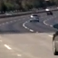
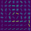
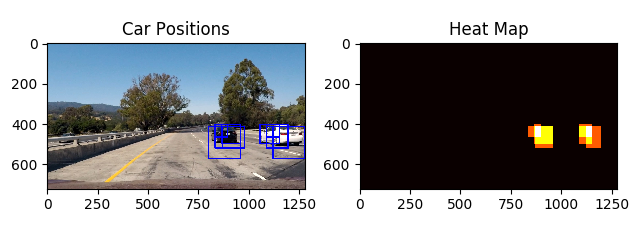
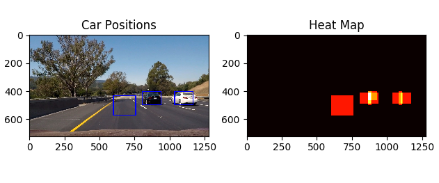
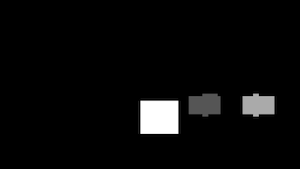

# Writeup

### **Vehicle Detection Project**

The goals of this project are the following:

* Performing a Histogram of Oriented Gradients (HOG) feature extraction on a labeled training set of images and training a Linear SVM classifier
* Applying a color transform and appending binned color features, as well as histograms of color, to the HOG feature vector.
* Implementing a sliding-window technique and using the trained classifier to search for vehicles in images.
* Run the pipeline on a video stream and creating a heat map of recurring detections frame by frame to reject outliers and follow detected vehicles.
* Estimating a bounding box for vehicles detected.

### Here I will consider the rubric points individually and describe how I addressed each point in my implementation.  

### The data

The training data consisted of images from one of the two labels: `cars` and `not cars`. The number of images in the two classes was around the same:

```python
vehicle_images = glob.glob('vehicles/**/*.png'))
non_vehicle_images = glob.glob('non-vehicles/**/*.png'))

print(len(vehicle_images))
print(len(non_vehicle_images))
```

```
8792
8968
```

### Histogram of Oriented Gradients (HOG)

#### 1. Extracting HOG features from the images

The code for the HOG feature extraction can be found in the `hog.py` and `feature_extraion.py` files.  

I started by reading in all the `vehicle` and `non-vehicle` images. Here are some examples of the dataset, both for vehicles and non-vehicles:

##### Car images:


##### Non-car images:





I then explored different color spaces and different `skimage.hog()` parameters (`orientations`, `pixels_per_cell`, and `cells_per_block`).  I grabbed random images from each of the two classes and displayed them to get a feel for what the `skimage.hog()` output looks like.

Here are some examples for the same images using the `RGB` color space and HOG parameters of `orientations=9`, `pixels_per_cell=(8, 8)` and `cells_per_block=(2, 2)`:

##### Vehicles




##### Non-vehicles


#### 2. Settling on HOG parameters

I tried various combinations of parameters.  At first I tried parameters that would result in better performance at the cost of accuracy, since at the beginning I was trying the get the pipeline to work at a basic level, then fine-tune it.
I was experimenting with color spaces: `RGB` turned out to be a not so good choice, `HSL` was even worse, but `YUV` seemed to perform much better. I decided to stick with `YUV` since it was war superior to the others.

After some experimentation, I've found that the feature extraction is much faster if I use larger cells - of course perhaps at the cost of accuracy.

The final parameter configuration was the following:

```python
CONFIG = {'pix_per_cell': 16,
          'cell_per_block': 2,
          'orient': 11,
          'cspace': 'YUV'}
```

#### 3. Training the classifier

I trained a linear SVM using `sklearn.svm.LinearSVC` in the `classifier.py` file:

```python
from sklearn.svm import LinearSVC
svc = LinearSVC()
X = np.vstack((car_features, notcar_features)).astype(np.float64)
y = np.hstack((np.ones(len(car_features)), np.zeros(len(notcar_features))))
X_train, X_test, y_train, y_test = train_test_split(X, y,
                                                    test_size=0.2, random_state=rand_state)
svc.fit(X_train, y_train)
```

The `classifier.py` is written as a standalone module so when it's run separately, it trains the classifier, and when it is imported, the classifier is not re-trained (to save time).


### Sliding Window Search

#### 1. Implementing the sliding window search.  How did you decide what scales to search and how much to overlap windows?

I experimented with various window scales. It did not seem to make sense to have a scale below `1`, because it made the process very slow and the window was very small, perhaps corresponding to cars that are far away, but those can be neglected in this case.

After some trial and error, I added ` 1.2`, `1.5`, `1.6`, `2`, `2.5`, `3` and `3.5` to the list of sclaes to be used. The reason for this is that it turned out to multiply detections by a large amount. This means that we have to deal with more duplicate detection, but it also means more data for the heatmap.

I configured `ystart` and `ystop` for each box size, because large vehicle images are unlikely to be close to the horizon, and small vehicle images are unlikely to be near the base of the image. A visualization of this can be seen below (note that it is an illustration and much more boxes are actually used):


The scales and corresponding `y` values can be seen below:

```python
scales =   (    1,          1.2,        1.5,       1.6,        2,         2.5,       3,          3.5)
y_values = ((400, 470), (410, 490), (400, 500), (430, 530),(440, 580),(410, 700),(430, 680), (420, 660))
```

#### 2. Some examples of test images to demonstrate how the pipeline is working.  Optimizing the classifier.

The `find_cars` function was used to find detections on an image. The return value of this function includes mutliple bounding boxes for the same car, like the image below shows:


We can then use these bounding boxes to construct a **heatmap** of the detections, thereby making our classification more robust. The heatmap image of the previous frame can be seen below:






Then, we apply a threshold on the heatmap, only considering values above the specified threshold. After that, we apply the `label` function from the `scipy.ndimage.measurements` module. This produces binary images like the ones below:





Finally we draw bounding boxes for the labes with the `draw_labeled_bboxes` function, and draw these boxes to the orginal image. The output is something like this:


### Video output

Processing the video stream is not different in essence than processing individual images. However, there is one difference that is not relevant in individual images: that of **caching** and taking into account past frames. This is a useful tool that can smoothen the detections and filter out false positives. I briefly describe my method below in code:

```python
class Cache:
    '''
    Helper class to keep track of the last few frames
    '''
    def __init__(self):
        self.boxes = []

    def add(self, boxes):
        self.boxes.append(boxes)
        if len(self.boxes) > 5:
            self.boxes = self.boxes[1:]

CACHE = Cache()

def process_image(img):
    ''' Main image processing pipeline '''
    boxes = find_cars_on_image(img)
    CACHE.add(boxes)
    heat = np.zeros_like(img[:,:,0]).astype(np.float)
    for previous_boxes in CACHE.boxes:  # Using cached values as well here, plus the newly found boxes (found in the current frame)
        heat = add_heat(heat, previous_boxes)
    heat = apply_threshold(heat, 18)
    heatmap = np.clip(heat, 0, 255)
    labels = label(heatmap)
    draw_img = draw_labeled_bboxes(np.copy(img), labels)
    return draw_img
```

Part of the optimization process was to **eliminate false positives**. This was mainly done with **thresholding**: if there are less than a certain number of detections for a car, then we reject that particular area of the heatmap. This works because there are some cases where we have a few detections for a false positive, but the true positives almost always have much more than that. Consider the following image for demonstration, where red dots mark the center of the detected bounding box:


In the above case, applying a threshold of 3 would eliminate the false positive on the middle of the road. Of course this parameter has to be fine-tuned to minimize false positives and misses (*false negatives*) as well.

Also, caching helps eliminating the false positives since it gives more weight to the boxes which were present in the recent frames, thus it can relatively reduce the weight of false positives that otherwise would just pop up once in a while on a few frames.

#### My final video submission can be found here:

[project_video_output.mp4](project_video_output.mp4)

### Discussion

My submission could benefit from:

- a more robust cache implementation that would give more weight to the bounding boxes detected in the last few frames.
- a smoothing function could be used to make the bounding boxes less wobbly
- additional tuning of the parameters, like the area to look for when we do the sliding window search. Ideally a very tight (not intersecting the car image, but surrounding it) bounding box should be found for the car detections.
- using more features (color and spatial histograms) seemed not to improve the model, so I purposefully avoided those in the final model, but perhaps they can add some value when they are configured properly.
- a more advanced feature could be trajectory estimation, which could further enhance the accuracy of the detections (estimating where a car will be in the next frame, and if indeed ther is one there in the next frame, giving it a bigger weight on the heatmap)
- using separate colors for nearby and close objects
- using separate colors for slow-moving and fast-moving objects (relative to the users camera)
